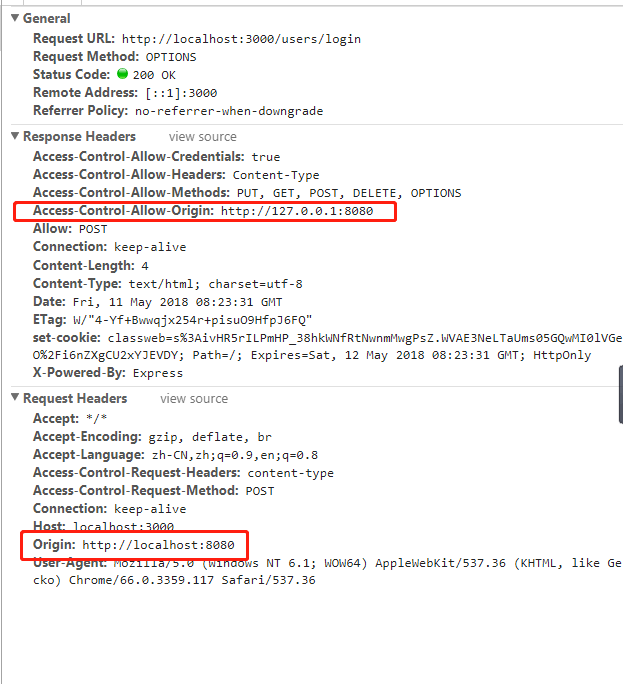

前段时间，同事遇到了一个跨域请求的问题，后端PHP设置了CORS跨域，但还是无法正常进行http请求。后来发现是因为浏览器在发送请求的时候带上了一个自定义的请求头字段，PHP的CORS请求好像没有设置这个字段，导致了无法正常请求，把添加的请求头字段去掉之后就正常了。既然涉及到CORS跨域，这里就简单总结下这方面的知识。

由于浏览器的同源策略，不同域名下的http请求是不能正常通信的，这就导致了跨域问题的出现，为了解决跨域问题，业内有很多处理跨域问题的解决方案，CORS就是其中的一种。

## 简介

CORS(跨域资源共享)分为两种，简单请求和非简单请求。    
简单请求只需要同时满足下面的两个条件：

> 1. 请求方法是下面几种方式之一：
* HEAD  
* GET    
* POST

2. HTTP请求头信息不超出下面几种字段
* Accept 
* Accept-Language   
* Content-Language  
* Last-Event-ID 
* Content-Type：只限于三个值application/x-www-form-urlencoded、multipart/form-data、text/plain

如果不能同时满足这两个条件的请求都是非简单请求。

在跨域请求发送之前，服务端需要设置相关的CORS跨域字段。先来看下服务端可以设置的CORS字段。

* Access-Control-Allow-Origin: 必须字段，该字段用于设置可以进行通信的域名，可以是具体的某个域名，也可以用*号表示接受任意的域名下的请求。

* Access-Control-Allow-Methods: 必须字段，表示允许以哪些http请求的方式进行通信，多个值的时候是以逗号分隔的列表，如："GTT,POST,PUT,DELETE,OPTIONS"。

* Access-Control-Allow-Headers: 如果http请求中有携带Access-Control-Allow-Headers字段，服务端就必须设置该字段，值是http请求中有携带的字段，多个值的时候是以逗号分隔的列表。

* Access-Control-Allow-Credentials: 可选字段，用于是否允许http请求中携带Cookie值。

## 简单请求

简单请求在发送http请求的时候，请求头部会加上Origin字段，表示本次http请求源的域名，然后服务端会根据这个字段去判定是否允许这次的跨域请求。如果http请求头部的Origin字段和服务端设置的允许通信的域名不一致，服务端会拒绝本次的请求，并且会返回错误信息，这种错误信息是无法通过请求状态码去判定的，因为这种情况的状态码还会是200，只能能通过XMLHttpRequest的onerror回调函数捕获。

服务端拒绝请求

返回的错误信息

## 非简单请求

非简单请求之前，浏览器会先发送一个预检请求，询问服务端，当前的域名是否在服务端设置的允许名单中，得到服务端的确认后，才会发送http请求。预检请求是通过 OPTIONS 方式发送请求的，请求头部字段中除了必要的Origin字段，还包括Access-Contorl-Allow-Methods字段，如果携带了自定义头部信息的话，那请求头部还会包括Access-Control-Headers字段。   
服务端收到预检请求后，会检查Origin，Access-Contorl-Allow-Methods和Access-Control-Headers字段，确认后会返回响应头信息。

